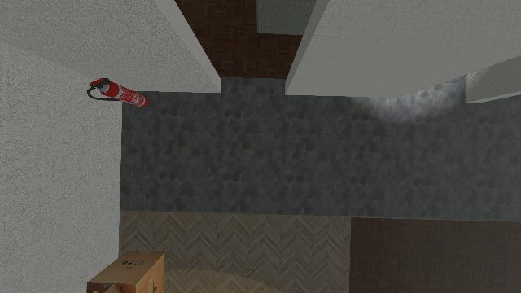
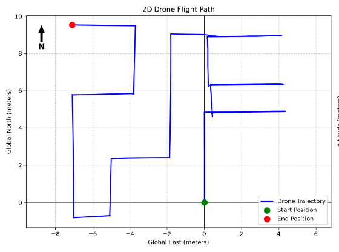
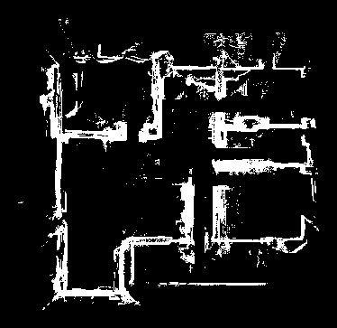
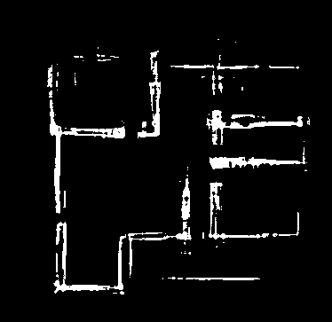

# 2D FLOOR PLAN RECONSTRUCTION USING ROSE WALLS AND IMU DATA

2D wall reconstruction from a 3D flyover mp4 video. Give it a video and its IMU log, get
back the building's wall structure as a denoised occupancy map.

### The problem

This is what the drone sees — one frame of 4801. Walls, floor, a fire
extinguisher, a cardboard box, all flattened into a top-down view with no idea
where in the building it is:

<p align="center">

</p>

There is no GPS and no map. The floor plan has to come out of the footage
itself.

### What comes out

<table>
<tr>
<td align="center"><b>1. Where the camera went</b><br><sub>stage 1 — visual odometry</sub></td>
<td align="center"><b>2. Walls stamped into a grid</b><br><sub>stage 2 — accumulation</sub></td>
<td align="center"><b>3. Structure kept, clutter cut</b><br><sub>stage 3 — ROSE filter</sub></td>
</tr>
<tr>
<td></td>
<td></td>
<td></td>
</tr>
<tr>
<td align="center"><sub>recovered from the video, scaled by the marker</sub></td>
<td align="center"><sub>15368 occupied cells</sub></td>
<td align="center"><sub><b>7229 cells — 53% removed</b></sub></td>
</tr>
</table>

A real run, straight from `small_world_flyover.mp4`. The two grids are the same
pixels cropped to one shared box, so the difference between them is the filter
and nothing else. Everything gone on the right is clutter, reflection and
pose-drift smear; the walls are untouched.

```
video + IMU csv
    -> STAGE 1  visual odometry          camera trajectory
    -> STAGE 2  wall grid from frames    raw occupancy accumulation
    -> STAGE 3  ROSE spectral filter     the denoised wall map     <- output
```

The output is the **frequency-filtered occupancy map**, not a vectorised floor
plan. The pipeline stops at `rose_intensity()`: no Hough fragments, no wall
fitting, no door carving, no single-line rendering. What comes out is the same
grid that went in, with everything that does not belong to the building's
dominant wall directions removed.

---

## Install

Python 3.10+.

```bash
python -m venv .venv
.venv/Scripts/activate          # Windows
# source .venv/bin/activate     # Linux / macOS
pip install -r requirements.txt
```

Install **only** `opencv-contrib-python`. Having it and `opencv-python` in the
same environment can shadow `cv2.aruco`, which stage 1 needs to fix scale and
the reference frame from the origin-marker pattern.

`models/best_segmentation.pt` is the wall/floor segmentation model and ships
with the project.

---

## Layout

```
recon.py                  run without installing
rose_recon/
    __init__.py           public API: configure, reconstruct, rose_intensity
    __main__.py           python -m rose_recon
    cli.py                argument parsing
    config.py             tuning constants + per-run paths
    perception.py         model loading, floor and wall masks   (shared)
    odometry.py           STAGE 1  visual odometry
    mapping.py            STAGE 2  wall grid accumulation
    rose.py               STAGE 3  the spectral filter
    pipeline.py           runs the stages, writes before/after
models/best_segmentation.pt
```

Dependencies run one way only: `config` <- `perception` <- `odometry`,
`mapping` <- `pipeline`. `perception.py` exists because both stages need the
segmentation model, and putting those helpers in either stage would make the two
import each other.

Paths are the one piece of shared mutable state, so they are handled carefully:
`config.configure()` fills them in per run, and every module reaches them as
`config.WALL_NPY` rather than importing the bare name. They are excluded from
`config.__all__` for that reason — a reference that forgets the prefix raises
NameError immediately instead of silently writing to the wrong place.

---

## Run

```bash
python recon.py --video path/to/flyover.mp4
# or, equivalently
python -m rose_recon --video path/to/flyover.mp4
```

As a library:

```python
import rose_recon

rose_recon.configure(video="flyover.mp4")
binary, wall_dirs = rose_recon.reconstruct()
```

Or filter an occupancy grid you already have, skipping stages 1 and 2 entirely:

```python
from rose_recon import rose_intensity

binary, wall_dirs = rose_intensity(raw_occupancy)   # uint8, 0 or 255
```

The IMU csv defaults to the video path with a `.csv` extension, which is how
recordings are normally shipped. Override it with `--imu` if not.

| Option | Effect |
|---|---|
| `--video <mp4>` | flyover footage to reconstruct (required) |
| `--imu <csv>` | inertial log; defaults to the video path with `.csv` |
| `--out <dir>` | output folder; defaults to `output/<video name>/` |
| `--force` | redo the video pass even if a trajectory is cached |
| `--force-map` | redo the wall accumulation even if a grid is cached |
| `--quiet` | no live odometry windows |

Results are cached per video. The first run does the full video pass and takes
a few minutes; re-running only redoes stage 3, which takes about a second. Two
videos never overwrite each other's cache.

### Output, under `output/<video name>/`

| File | What it is |
|---|---|
| `walls_rose.png` | **the deliverable** — wall map after the spectral filter |
| `walls_before.png` | raw accumulation, straight out of stage 2 |
| `wall_raw.npy` | that raw accumulation as an array |
| `camera_poses.csv` | recovered trajectory |
| `tuning/` | stage-3 intermediates |

Both PNGs are white-on-black at the grid's own resolution, so they line up
pixel for pixel and can be diffed directly.

### Reading the log

Two lines tell you whether a run went well:

```
[map] frames accumulated: 1472, ..., raw wall cells: 15368
[rose] ridges [0, 90] deg | raw 15368 -> structure 12909 -> binary 7229 px
```

A raw-cell count that has not collapsed to near zero means stage 2 found walls,
and ridge angles that match your building mean stage 3 locked onto the right
directions. If the ridges look wrong, the trajectory is drifting and the problem
is upstream in stage 1 — no stage-3 setting will fix it.

---

## How stage 3 works

**The method is ROSE, published by Kucner, Luperto et al.** The idea
of using the frequency spectrum of an occupancy map to separate structure from
clutter is theirs, and this project would not exist without it. See
[Credits](#credits) for the papers and the reference implementation.

What is ours is `rose_intensity()`, our own implementation of that idea written
from the papers, tuned for aerial flyover footage rather than the ground-robot
SLAM maps ROSE was designed around, and stopping at the filtered grid instead of
continuing to room segmentation.

Walls in a built environment are long, straight, and nearly all parallel to one
of a small number of directions. In the 2D Fourier transform of the occupancy
map they therefore concentrate into a few angular ridges. Clutter, reflections
and pose-drift smear have no such preference and spread evenly across all
angles. That difference is the whole filter.

1. **Transform.** FFT the binarised occupancy map.
2. **Find the wall directions.** Build an angular histogram of amplitude over
   everything above `LOW_FREQ_KEEP`, blur it, and take the `N_DIRECTIONS`
   strongest peaks at least 30 degrees apart. For a rectilinear building these
   come out near 0 and 90 degrees.
3. **Keep only those wedges.** Mask the spectrum to +/- `WEDGE_DEG` around each
   peak, plus the low frequencies that carry the building's overall shape, and
   transform back. Structure is rebuilt; noise is not.
4. **Structure cut.** Of the cells that were occupied to begin with, keep the
   strongest `KEEP_FRACTION` by spectral response.
5. **Intensity cut.** Box-filter the response over the survivors and drop those
   below the `INT_Q` quantile, which removes isolated specks that survived the
   wedge but sit in no dense neighbourhood.

On a typical flyover this removes about half the occupied cells while leaving
the walls intact.

### Tuning

All in `rose_recon/config.py`.

| Setting | Effect |
|---|---|
| `N_DIRECTIONS` | how many wall directions the building has. 2 is rectilinear; raise it for non-orthogonal layouts |
| `WEDGE_DEG` | half-width kept around each direction. Wider tolerates skew and drift, narrower cuts more clutter |
| `LOW_FREQ_KEEP` | radius of low frequencies passed through untouched |
| `KEEP_FRACTION` | structure cut. Lower keeps less |
| `INT_Q` | intensity cut. Higher removes more isolated survivors |

If the result looks over-cut, raise `KEEP_FRACTION` and lower `INT_Q` first —
those two do most of the work. If walls are missing entirely, check the ridge
angles printed by stage 3 before touching anything else: they should match the
building, and if they do not, the trajectory is drifting and the problem is
upstream in stage 1.

---

## The segmentation model

`models/best_segmentation.pt` is **our** wall segmenter, trained for the scenes
this project was developed on. It is a starting point, not a requirement — the
pipeline treats it as a black box, and swapping in one trained for your own
environment is the single highest-value change you can make.

### How ours was trained

Read straight out of the checkpoint, so it matches the file in this repo:

| | |
|---|---|
| Base model | `yolov8n-seg.pt` (pretrained, fine-tuned) |
| Task | `segment`, single class — `{0: 'wall'}` |
| Framework | Ultralytics 8.4.78 |
| Epochs | 200, `patience=30` |
| Image size | 640 |
| Batch | 8 |
| Optimiser | AdamW, `lr0=0.001`, `lrf=0.01`, `weight_decay=0.0005` |
| Warmup | 3 epochs |
| Seed | 0, `deterministic=True` |
| Trained | 2026-07-11 |

Augmentation was kept deliberately mild, because the input is nadir-ish aerial
footage where scale and orientation are roughly fixed:

```
hsv_h 0.015   hsv_s 0.5   hsv_v 0.5      # lighting only
degrees 5     translate 0.05  scale 0.2  # small geometric jitter
fliplr 0.5    flipud 0.0                 # horizontal only
mosaic 0.0    mixup 0.0    cutmix 0.0    # OFF -- see below
erasing 0.4
```

Mosaic and mixup are off on purpose. They stitch several images into one, which
invents wall junctions that never existed and teaches the model corner geometry
the building does not have. For a detector that is fine; for a segmenter whose
output is integrated into a metric occupancy grid, those hallucinated junctions
survive into the map and the spectral filter happily preserves them, because a
fake straight wall looks exactly like a real one in the frequency domain.
`flipud` is off for the same class of reason: overhead footage has a consistent
lighting direction, and flipping vertically makes shadows fall upward.

Reproducing it, given a dataset in YOLO segmentation format:

```bash
yolo segment train \
    model=yolov8n-seg.pt data=your_dataset/data.yaml \
    epochs=200 patience=30 imgsz=640 batch=8 \
    optimizer=AdamW lr0=0.001 seed=0 \
    mosaic=0.0 mixup=0.0 flipud=0.0 degrees=5 scale=0.2
```

### Using your own model

Point the pipeline at it — no code change needed:

```bash
python recon.py --video flyover.mp4 --model path/to/your_walls.pt
```

It has to satisfy exactly three things:

1. **Ultralytics segmentation model.** Called as `model(frame)` and read through
   `results.masks` and `results.boxes`. Any YOLO `-seg` variant works; `n`, `s`
   and `m` are all fine, and a bigger one is worth trying if you have the GPU.
2. **Class 0 is wall.** The code keeps class 0 and ignores the rest, so a
   multi-class model works as long as wall sits at index 0.
3. **It runs at your source resolution.** Frames are passed through unresized.

The confidence floor is deliberately low — `SEG_CONF = 0.20` in `mapping.py`,
`WALL_SUSPICION_CONF = 0.20` in `odometry.py`. Stage 3 is what removes false
positives, so the segmenter is allowed to over-call walls; missed walls cannot
be recovered later, but spurious ones are cut by the spectral filter. Bias
your training and your threshold toward recall.

This is where the biggest wins are. The reconstruction quality is bounded by two
things — how well the segmenter finds walls in *your* footage, and how well the
trajectory holds up in stage 1. If your scenes look nothing like ours (different
altitude, different roof materials, outdoor rather than indoor), retraining on a
few hundred of your own annotated frames will do far more than any parameter in
`config.py`.

---

## Notes

Stage 1 can also detect people on the same video pass. That is irrelevant here,
so `DETECT_VICTIMS` in `config.py` is off and the person-detection weights are never loaded or
required.

`odometry.py`, `mapping.py` and `rose_intensity()` are lifted unchanged from the SAR
flyover pipeline they were developed in. Only the configuration and the entry
point are new, so the reconstruction behaves identically to that pipeline up to
the point where it stops.

---

## Credits

This project implements **ROSE**, and the method belongs to its authors:

> T. P. Kucner, M. Magnusson, et al.
> *Robust Frequency-Based Structure Extraction.*
> [arXiv:2004.08794](https://arxiv.org/abs/2004.08794)

> M. Luperto, T. P. Kucner, et al.
> *Robust Structure Identification and Room Segmentation of Cluttered Indoor
> Environments from Occupancy Grid Maps.*
> [arXiv:2203.03519](https://arxiv.org/abs/2203.03519)

Reference implementation: [aislabunimi/ROSE2](https://github.com/aislabunimi/ROSE2).
**If you use this project in academic work, cite their papers, not this
repository** — the contribution is theirs.

`rose_intensity()` here is our own implementation, written from those papers and
adapted for aerial flyover footage. It covers the ROSE spectral filter only; the
room segmentation and floor-plan vectorisation that ROSE2 adds are not
reproduced here.
